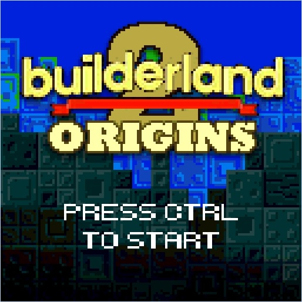
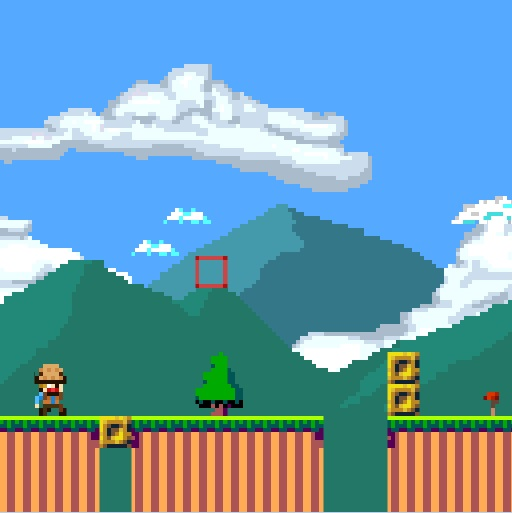
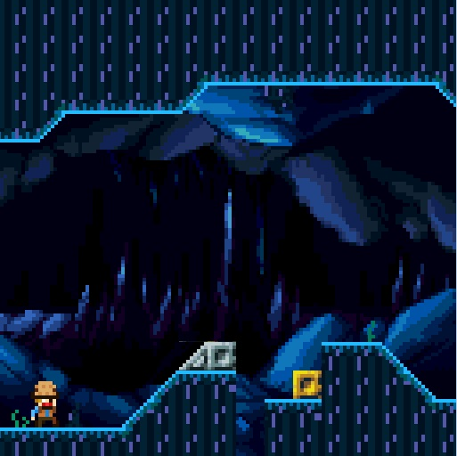
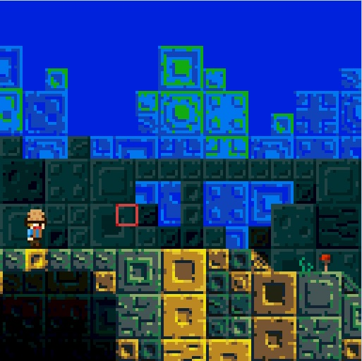

  <h1 align="center">Builderland 2: Origins</h3>

  

    Builderland 2: Origins is the winner game of the <a href="https://itch.io/jam/retro-game-jam-2015">Retro Game Jam 2015</a>.
     
    Sequel of Builderland, a game from Loriciel released in 1990. 
     
    Done by Alexandre Lecomte, <a href="https://github.com/neovoxel">Pierre Planeau</a> and <a href="https://github.com/torresflo">Florian Torres</a>.
     
  

## Table of Contents

* [The Game](#the-game)
  * [Controls](ontrols)
* [Installation](#installation)
* [Screenshots](#screenshots)
* [License](#license)

## The Game

In this pixel and retro loving edition, help your character to discover the origins of the mysterious protective blocks you control and help him to progress through the different levels.

This game was created with Unity during the Retro Game Jam 2015 in Montpellier (France) in 36 hours with the following constraints:
- Screen resolution: 128 x 128 pixels
- Maximum size of graphic assets: 64 Kb
- Sequel of a game from the company Loriciel

The game contains 4 levels with 3 different environments.

Note that the project has not changed since its release in 2015, and has only been opened and builded recently with Unity 2018.3.0.

### Controls

The character is moving automatically from the left to the right. You need to create a path by moving blocks on his path.

Keyboard controls:
- `←` `↑` `→` `↓` : Move cursor
- `Ctrl` : Grab/Ungrab a block with the cursor
- `R` : Restart level

## Installation

You can play the game directly in your browser [here](https://torresflo.github.io/Builderland-2-Origins/)!

If you want to run it on your computer, download the last build for Windows (Unity 2018) [here](https://github.com/torresflo/Builderland-2-Origins/releases/tag/v1.0), unzip it, and play!
 
You can also download the original version of the game (released in 2015 for the Game Jam) on [itch.io](https://builderland2origins.itch.io/thegame).

## Screenshots

 \

 \

<!-- LICENSE -->
## License

Distributed under the GNU General Public License v3.0. See `LICENSE` for more information.